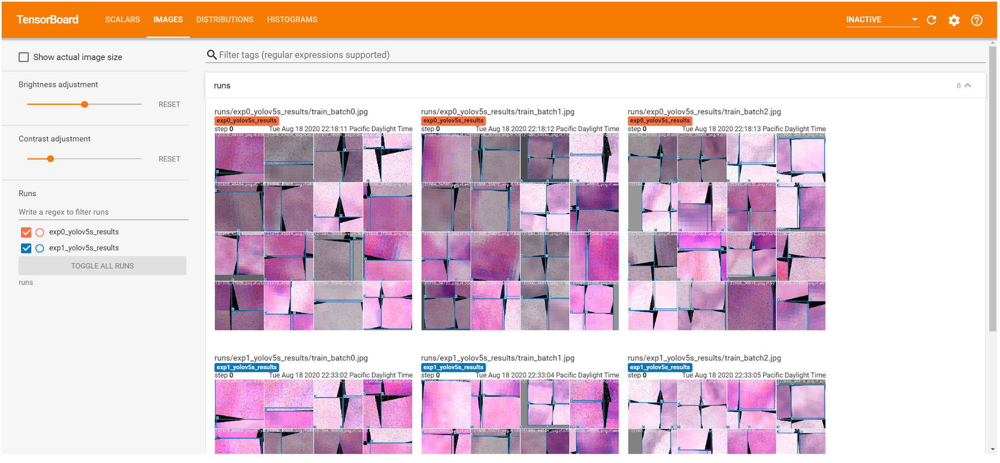
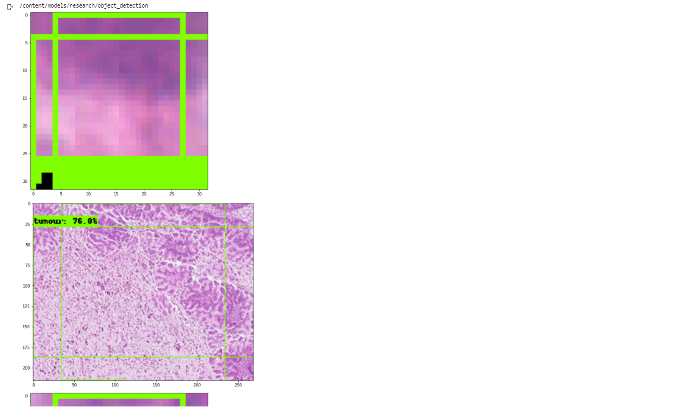

Pathomatic is an app that detects regions of cancer using a TensorFlow model on Android devices. AIPMOC stands for Artificial Intelligence in Precision Medicine for Ovarian Carcinoma. Within this project, we are integrating a machine learning model that detects the boundaries of cancerous portions of a microscope image via camera input. We are deploying this model on an android application using a Flutter front end and TensorFlow lite back end. The next step in this process is to digitally reconstruct the microscope slide using an image stitching algorithm. This process is accomplished by sending an email to a server that processes the request. The server returns the email with the stitched image in a .tiff file format. Ultimately, the goal of this project is to aid pathologists who don't have access to expensive slide scanners and allow lab technicians to capture relevant regions of image (ROI) without the constant intervention of a pathologist.

## Packages
* Flutter
* TensorFlow Lite
* Microsoft Image Composite Editor

## Installation
### Windows
1.  Install Android Studio
  * Follow the installation wizard from Android Studio website
  * **Note the installation directory of the Android SDK**
  * Deafult location is `C:\Users\<username>\AppData\Local\Android\sdk`

2. Install Flutter
  * Download the following installation bundle to get the [latest stable release of the Flutter SDK (1.17.1)](https://storage.googleapis.com/flutter_infra/releases/stable/windows/flutter_windows_1.17.1-stable.zip)

  * For other release channels, and older builds, see the SDK archive page.

  * Extract the zip file and place the contained flutter in the desired installation location for the Flutter SDK (for example, `C:\src\flutter` do not install Flutter in a directory like `C:\Program Files\` that requires elevated privileges).

  * You are now ready to run Flutter commands in the Flutter Console!

If you wish to run Flutter commands in the regular Windows console, take these steps to add Flutter to the PATH environment variable:

From the Start search bar, enter ‘env’ and select Edit environment variables for your account.

Make an entry called `ANDROID_HOME` with the directory path of your Android SDK.

Under User variables check if there is an entry called Path:

If the entry exists, append the full path to `flutter\bin` using ; as a separator from existing values. Your window should look like the image in figure 1.

<b>Figure 1.</b> Environment variables for your user

If the entry doesn’t exist, create a new user variable named Path with the full path to flutter\bin as its value.

Lastly, add these variables to your Path variables:
  * `%ANDROID_HOME%\tools`

  * `%ANDROID_HOME%\platform-tools`

  * `%ANDROID_HOME%\emulator`

These additions should resemble the image in figure 2.

<b>Figure 2.</b> Path variable list

Note that you have to close and reopen any existing console windows for these changes to take effect. All of these instructions were taken from the Flutter documentation, so if you encounter any issues please review those first before opening an issue.

## Results
The app works well and so far includes the following features: welcome page to alert the user of camera access, information fields for image naming convention, main dashboard, image stitching algorithm to digitally reconstruct entire microscope slides, YOLO + SSD pre-trained models (Will replace with Ovarian-Cancer-specific model soon), and lastly firebase upload for all images

### Screenshots

  |  
:-------------------------:|:-------------------------:
**Figure 3.1.** Tensorboard of training            |  **Figure 3.2.** Inference Results

Photos of Applications are coming soon, WIP.

## Contributing
Pull requests are welcome. For major changes, please open an issue first to discuss what you would like to change.

Please make sure to update tests as appropriate.

## License
[MIT](https://choosealicense.com/licenses/mit/)
